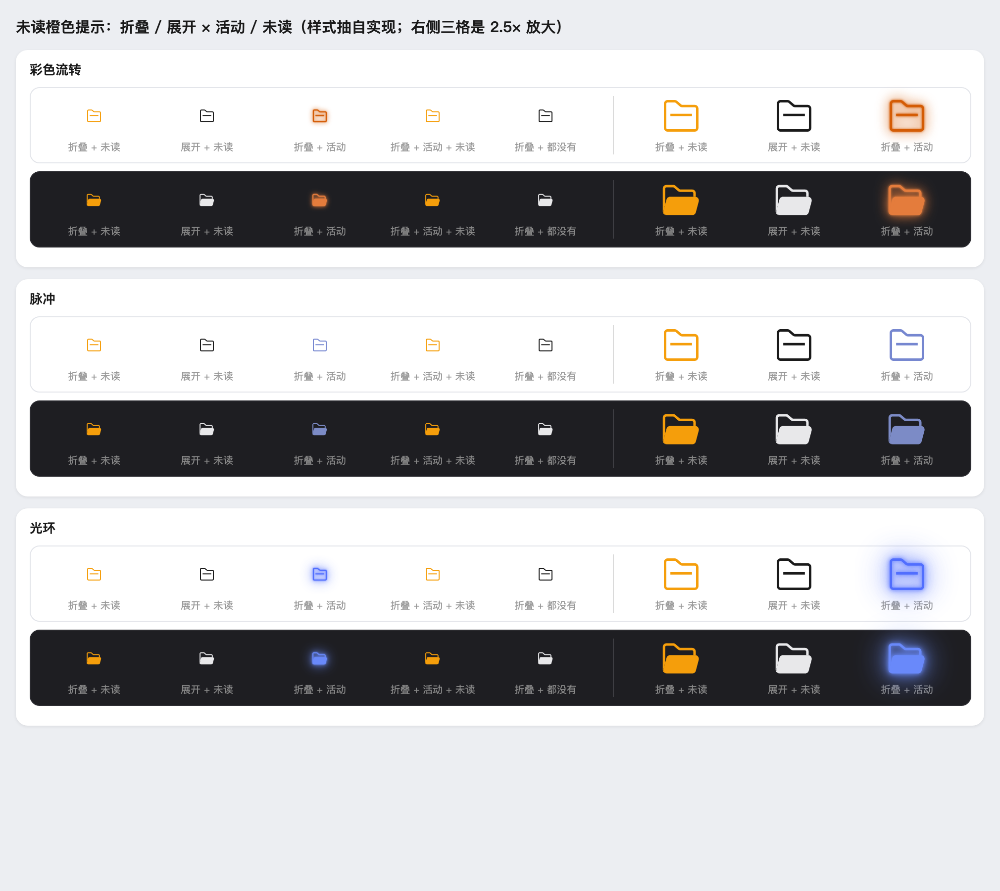
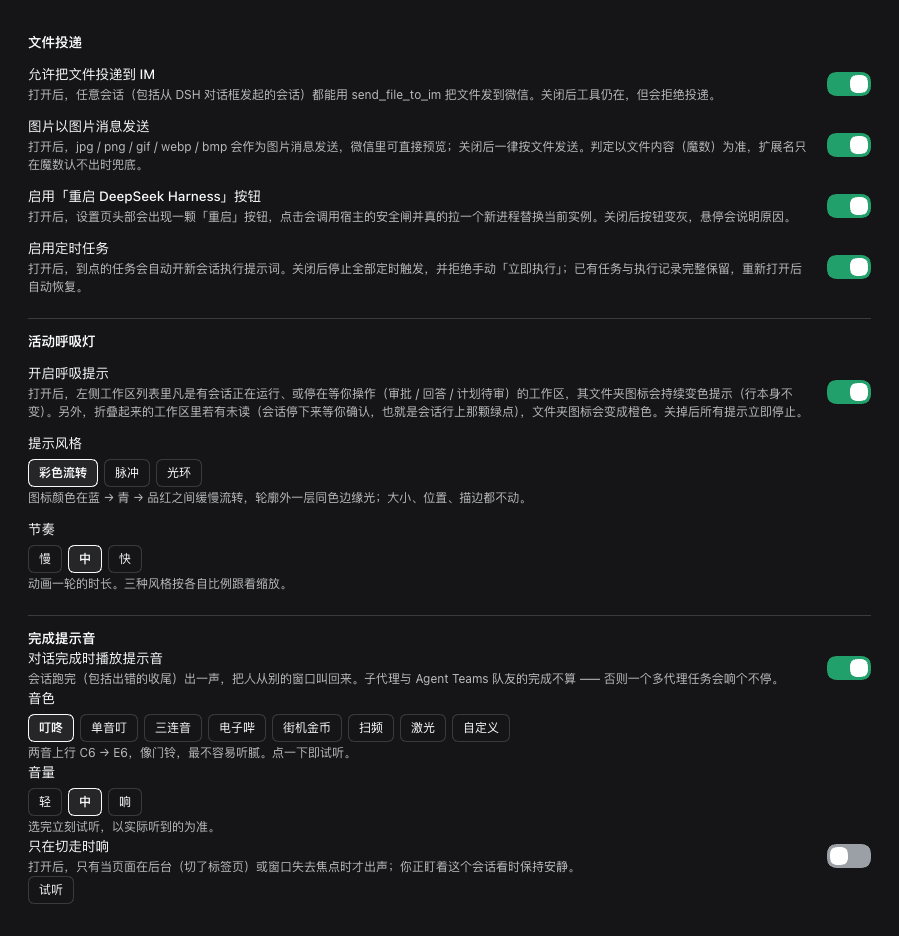

# 辅助补丁（dsh-helper）

[](https://www.npmjs.com/package/dsh-helper)
[](./LICENSE)

给 DeepSeek Harness 补上几件它自己没做的事：

| 能力 | 一句话 |
| --- | --- |
| **把文件发到微信** | 在**任意** DSH 会话（含网页/CLI 对话框发起的）把本机文件主动投递到 IM；图片/视频自动走图片/视频消息 |
| **定时任务** | 按 cron 把一段提示词交给一个**全新**的 agent 会话执行，带执行记录与关联会话 |
| **活动呼吸灯** | 工作区图标随会话状态呼吸，折叠时用橙色标记未读 |
| **活跃指示** | 会话标题栏一枚心电图：有活动或有待看就亮，点开列出需要注意的会话并直接接上 |
| **对话完成提示音** | 会话跑完出一声（可只在切走时响），音色与音量可调 |
| **关闭侧栏毛玻璃** | macOS 桌面端左侧栏那层系统原生毛玻璃，一个开关盖掉 |
| **一键重启** | 设置页头部一键重启宿主（四道安全闸） |

**它不修改 IM 插件一行源码**，只读复用它的实现与账号配置。装了哪个就走哪个后端：

| 后端 | 复用什么 | 何时使用 |
| --- | --- | --- |
| `@michengai/dsh-im-connect` | 它的微信通道工厂（`createWeixinChannel` → `sendFile`），由本插件造一个「只发不收」的实例 | 装了就用它（默认） |
| `@xmanrui/dsh-im` | 它的微信协议模块（`weixin-api.mjs` + `state-store` / `config-store`），由本插件串起「读文件 → 上传 → 发送」 | 没装 im-connect 时退回 |

---

## 解决什么问题

IM 插件自己的文件投递只发生在**它接管的那个 IM 会话里**：回合结束时，把它认得的产出（`write`/`edit` 成功的文件、`present` 明确交付的文件）回传到聊天窗口。所以「在 DSH 桌面/网页对话框里说『把这个文件发我微信』」这条路它覆盖不到——文件交付不出 IM 会话。

本插件补的就是这一段：在任何会话（含网页 / CLI / 定时任务新开的会话）主动把本机文件投递到 IM。做法是复用 IM 插件**已经写好的实现**、由本插件完成编排，而不是复刻协议：登录态、CDN 加密上传、`context_token` 发送、图片/视频/文件分流都归上游。为什么不 patch 上游、也不复刻协议，见[开发文档](./docs/DEVELOPMENT.md#im-只读复用)。

## 安装

**前提：先装好一个 IM 插件并接入微信。** 本插件复用它的通道与账号配置，没有它投递无法工作（其余能力不受影响）：

- **`@michengai/dsh-im-connect`（推荐）** —— 多平台 IM 助理；装好后在它自己的设置里扫码接入微信；
- **`@xmanrui/dsh-im`（旧）** —— 在「设置 → IM机器人」里接入微信。

两个都装时默认走 im-connect（要改见下面的 `backend`）。

**DSH Web / CLI**：

```bash
# 1. 装一个 IM 插件（二选一），并在它自己的设置里接好微信
dsh plugin --profile web add @michengai/dsh-im-connect   # 或 @xmanrui/dsh-im

# 2. 装本插件
dsh plugin --profile web add dsh-helper
```

**DSH Desktop**：在**插件市场**里依次搜 `@michengai/dsh-im-connect`（或 `@xmanrui/dsh-im`）与
`dsh-helper` 安装（桌面端的 profile 由 Electron 应用独占，`dsh plugin --profile desktop`
会被 CLI 拒绝 —— 任何插件都一样）。

装完**重启 DSH**。你会得到：插件信息页的设置卡片、Agent 工具 `send_file_to_im`、
侧栏「定时任务」入口、任何会话可用的 HTTP 投递端点。

## 把文件发到微信

### 入口一：工具 `send_file_to_im`

给 Agent 用，**只对「建立时已加载本插件」的会话可见**（已在跑的会话请用 HTTP 入口）。

| 参数 | 必填 | 说明 |
| --- | --- | --- |
| `path` | 是 | 文件绝对路径，或相对当前工作区的路径 |
| `toUserId` | 否 | 临时指定收件人 |

### 入口二：HTTP 端点

给任何会话、任何脚本用，不依赖工具表：

```bash
curl -s -X POST http://127.0.0.1:19387/api/dsh-helper/send-file \
  -H 'content-type: application/json' \
  -d '{"path":"/绝对/路径/文件.ext"}'
```

> 端口以宿主实际监听的为准（DSH Desktop / `dsh web` 当前是 **19387**）；此前这里写的是 3080，那是旧版本的默认端口，照抄会连不上。

成功返回：

```json
{"sent":true,"fileName":"...","bytes":2378,"toUserId":"...","botId":"...","hadContextToken":true,"via":"image"}
```

`sent: true` 只代表**平台已受理**，不代表对方已读；`via` 是 `"image"`（图片消息）/ `"video"`（视频消息）/ `"file"`（文件）；`hadContextToken: false` 见[常见问题](#常见问题)。

**来源限制**：该路由能读本机任意文件并发走微信，因此浏览器请求必须与 DSH 同源，跨站 POST 会被 **403**；curl 与本机脚本无 Origin，照常可用。文件超 **200 MiB** 在读取前直接拒绝，投递超过 **5 分钟**未完成会以 **504** 取消。

**残留的暴露面（照实说）**：拦得住跨站，拦不住**同机的其它进程** —— 它们发的请求同样没有 Origin，与你的 curl 无法区分，因此默认也能调这个路由把文件发走。单用户的个人电脑上这通常可以接受；多用户机器、或本机跑着不信任的进程时，请打开下面两道闸门。

**两道可选闸门**（设置页 →「文件投递」卡片，**都默认关闭**：不开就与从前逐字节同行为，既有脚本一个字都不用改）：

| 闸门 | 关掉时 | 打开后 |
| --- | --- | --- |
| HTTP 投递口令 | 任何本机进程都能调 `/send-file` | 每个请求都必须带口令（请求头 `x-dsh-helper-token`，或 body 的 `token` 字段），否则 **401** |
| 允许投递的目录 | 任何本机路径都能发（包括 `~/.ssh` 这类） | 只有白名单目录**及其子目录**里的文件能发出去，其余一律拒绝 |

带了口令的 curl：

```bash
curl -s -X POST http://127.0.0.1:19387/api/dsh-helper/send-file \
  -H 'content-type: application/json' \
  -H 'x-dsh-helper-token: 你的口令' \
  -d '{"path":"/绝对/路径/文件.ext"}'
```

几点说明：

- 口令**从不回显**：`GET /api/dsh-helper/config` 只返回 `sendTokenSet` 这一个比特，设置页也只显示「已设置」。那条 GET 与本路由同属"无 Origin 的本机请求也放行"，回明文就等于任何同机进程都能读到口令，闸门形同虚设。改口令是三段式：不传该字段 = 不修改，传空串 = 清除，传非空 = 设置。
- 目录白名单对**工具路径同样生效**（`send_file_to_im` 也走同一个读文件收口点），否则模型调用那条路就成了绕过白名单的后门。
- 白名单两侧都会做 `realpath`：既防止"在白名单目录里放一个指向 `/etc/passwd` 的符号链接"这种绕过，也保证 macOS 上 `/tmp`（真实路径 `/private/tmp`）这类写法不会把合法路径误拒。目录可用 `~` 表示家目录。

### 图片 / 视频自动走「图片消息」「视频消息」

微信的附件分成互不相通的消息类型：按文件发落成一张要点开的文件卡片，按图片/视频发则能直接预览。**谁来判定，取决于后端**：

| 后端 | 判定依据 | `imageAsPicture` 开关 |
| --- | --- | --- |
| im-connect | 文件名后缀，发送前按**内容魔数**纠偏：真图片叫错名字会自动纠正后缀按图片发（可直接预览），文本改名 `.jpg` 会改按文件发（免得被微信拒收）。只动发送时的文件名，磁盘原文件不动 | 不生效（上游自己决定，我们插不上手） |
| dsh-im | 本插件按**内容魔数**（JPEG/PNG/GIF/WebP/BMP），扩展名只在魔数认不出时兜底 | 生效：关掉就一律按文件发 |

dsh-im 后端另有一个自动降级：上游还没有 `sendImage`（老版本）时自动退回按文件发。

## 定时任务

按 cron 把一段提示词交给一个**全新**的 agent 会话执行。面板在**侧栏 → 定时任务**。

### 新建一条

| 字段 | 说明 |
| --- | --- |
| 标题 | 最多 200 字符，运行时会钉成会话标题「标题 · MM-DD HH:mm」 |
| 提示词 | 最多 20000 字符，**原样**提交给新会话（`@专家名` 照常生效） |
| 运行时间 | cron 表达式（见下） |
| 启用 | 停用后保留数据，不再触发 |
| 工作区 | 不绑定 / 绑定已有工作区 / 自定义绝对路径（目录不存在自动创建） |

列表支持搜索与「全部 / 已启用 / 已停用」过滤，每条行尾有「立即执行 / 编辑 / 停用·启用 / 删除」。

**总开关**（设置卡片里的「启用定时任务」）控制整个功能：关闭后左侧入口整条消失、停止全部触发、拒绝手动执行；任务与记录保留，重新打开后一起恢复。

### 自然语言建任务

在对话里说「帮我每天 9 点半获取每日热点新闻 10 条」，Agent 会调用 `create_schedule_task` 建好。若 DSH 官方的「自动化任务」也开着，Agent 会**先弹窗让你选**独立任务还是会话内提醒，不替你决定。除创建外还有 `list_schedule_tasks` / `update_schedule_task` / `delete_schedule_task`，改和删都会先回显目标标题与 cron 让你确认。

### cron 怎么写

`分 时 日 月 周`，首位可加秒（秒 ≠ 0 时写六段），例如 `0 9 * * *`。面板提供图形化选择器（每天 / 每周 / 工作日 / 每 N 小时 / 每 N 分钟 / 自定义），切「自定义」直接写表达式；保存前显示**最近 5 次执行时间**供确认。

### 只跑一次（"今年 9 月 28 日"这种）

cron 没有「年」这个位置，`0 9 28 9 *` 字面意思是「每年这天」。把**「最多执行次数」填 1** 即可：**成功**跑完那一次自动停用（列表标「限次 1/1」）。上限与已跑次数落盘，重启宿主不重跑。

只有成功的运行消耗次数：**失败不计数**（否则一次性任务失败一次就永久停用，连重试的机会都没有），改为**连续失败 5 次自动停用**（列表标「已连续失败 5 次」），成功一次即清零。这个计数同样落盘，重启不会把它重置 —— 它的作用是止损：一个配了坏提示词的分钟级 cron 否则会无限开新会话烧额度。

### 时区与夏令时

cron 按**宿主进程所在的本地时区**解释（不传 `timezone` 给 croner，跟随系统设置）。所以「每天 9 点」就是你这台机器上的 9 点；面板里「最近 5 次执行时间」也按本地时区显示，不会有 8 小时偏移。

有夏令时的时区里，切换当天的行为是**实测**出来的（croner 9.x，2026-09-28）：

| 情况 | 表现 |
| --- | --- |
| 春季拨快，任务时间落在「不存在的那一小时」（如纽约 2026-03-08 的 02:30） | 当天**推后 1 小时**触发（03:30），**不会跳过这一天** |
| 秋季拨慢，任务时间落在「重复出现的那一小时」（如纽约 2026-11-01 的 01:30） | 当天只触发**一次**（取第一次），**不会跑两遍** |

中国时区（`Asia/Shanghai`）没有夏令时，上面两条对国内部署不适用；只有宿主跑在别的时区时才需要关心。

想自己复现（`nextRuns(n, from)` 从指定时刻往后算）：

```bash
cat > /tmp/tz-probe.mjs <<'EOF'
import { Cron } from "croner";
const [, , expr, from, n] = process.argv;
const job = new Cron(expr, { paused: true });
for (const d of job.nextRuns(Number(n ?? 3), from || undefined)) {
  console.log(`   ${d.toISOString()}   本地: ${d.toString().slice(0, 24)}`);
}
job.stop();
EOF
TZ=America/New_York node /tmp/tz-probe.mjs "30 2 * * *" "2026-03-06T12:00:00Z" 3   # 春季拨快
TZ=America/New_York node /tmp/tz-probe.mjs "30 1 * * *" "2026-10-30T12:00:00Z" 3   # 秋季拨慢
```

⚠️ 每个时区要用**独立进程**跑（像上面这样分两条命令）：在同一个进程里改 `process.env.TZ` 不总生效，V8 会缓存时区数据，测出来的结果可能是上一个时区的。

### 执行与记录

执行时在绑定工作区下**新建会话**、挂默认 preset，把提示词作为**用户消息**提交；同一事项**不并发**（上一轮没跑完就跳过本轮）。每条保留**最近 20 次**执行记录（时间、成败、当次提示词，成功还带会话 id），可点「关联会话」跳回或恢复已归档会话。

**上限**：事项 200 条、单事项记录 20 条。数据在 `$DSH_HOME/integrations/dsh-helper/schedule.json`（原子写）。

## 活动呼吸灯

工作区行的**文件夹图标**随会话状态呼吸，不动行背景、不做缩放。

| 风格 | 说明 |
| --- | --- |
| **彩色流转**（默认） | 蓝 → 青 → 品红流转，带一层边缘光 |
| **脉冲** | 常态灰与主题蓝之间明暗脉动 |
| **光环** | 轮廓外柔光呼吸扩散 |

**活动** = 会话正在跑或停在等你操作；**未读** = 会话在主视图外停下等你确认。折叠时绿点看不见，就把图标染成橙色顶上（橙色优先于活动呼吸）。



## 活跃指示

会话标题栏（右上角那排按钮里）一枚**心电图图标**：有会话正在跑、或有事等你查看时显示彩色，高亮沿着心电路径来回滚动；全部空闲且没有待看的显示灰色、静止。它只是指示，不挡任何点击。

点它弹出「需要注意的会话」清单：

| 行 | 含义 |
| --- | --- |
| **当前会话** | 面板顶部固定一行：当前会话 id + 标题，点一下复制 id |
| **运行中** | 绿点；正在跑的主会话（**只有子代理在跑也算**）排在前面 |
| **待查看** | 橙点；跑完停在等你确认（`completed`）的主会话 |

清单里每条都能点：会先展开它在侧栏所属的**工作区分组**（宿主对已折叠过的分组不会自动展开），再直接接上那个会话；每条下面的小字是会话 id，点一下即复制。子代理会话与「新会话」占位行刻意不进清单 —— 用户要的是「点开能接上的主会话」。

设置卡片里可以整个关掉（「显示活跃指示」，默认开）。偏好存 `localStorage`，与呼吸灯、提示音一致。这项能力 2026-09-28 从 **T专家（dsh-expert）** 迁来，位置、外观与行为都没变。

## 对话完成提示音

会话**跑完**出一声。声音由浏览器现场合成（Web Audio 振荡器 + 包络），插件不含任何音频文件。

| 设置 | 默认 | 说明 |
| --- | --- | --- |
| 播放提示音 | 开 | 总开关 |
| 音色 | 叮咚 | 叮咚 / 单音叮 / 三连音 / 电子哔 / 街机金币 / 扫频 / 激光 / 自定义；点一下即试听 |
| 音量 | 中 | 轻 / 中 / 响 |
| 只在切走时响 | 关 | 打开后只有页面在后台或窗口失焦时才出声 |

**自定义提示音**：音色选「自定义」后挑一个浏览器能解码的音频（mp3/wav/m4a/ogg 等，≤ 4 MB），存在浏览器 IndexedDB，**不上传**、不写插件目录，只属于当前浏览器。

「完成」= 会话执行状态由跑转停（同一份状态快照，不加宿主钩子）。两条刻意的设计：**停下来等 300ms 再响**（避免多轮任务连响）、**只认顶层会话**（子代理与 Agent Teams 队友不算）。

## 界面外观

| 设置 | 默认 | 说明 |
| --- | --- | --- |
| 关闭侧栏毛玻璃 | 关 | 盖掉 macOS 桌面端左侧栏那层**系统原生毛玻璃**，还原成实色侧栏 |

这层毛玻璃不是插件画的，而是**原生窗口材质**：桌面端在 macOS 上创建窗口时写死 `vibrancy: "sidebar"` + 窗口底色全透明（`app.asar` 内 `lib/main.js`），渲染层再让开底色——官方 base.css 在 `html[data-platform=darwin]` 下把 `html`/`body` 设为 `transparent`，ui-layout 把框架设为 `none`，侧栏列只填 **40%**（深色 50%）不透明色，而主内容列与右栏是实色。所以只有左边那一条能透出模糊，右侧永远是纯色。

宿主没有开关（主进程只在最小化/隐藏时临时 `setVibrancy(null)`），也没有环境变量可关。本插件用**纯样式覆盖**实现：给 `body` 铺上不透明的 `--dsw-alias-bg-base`（随深浅主题走，`html,body,#root` 都是满高，铺满整个视口 → 底下那层原生模糊被完全遮住），再把侧栏列还原成官方**非 macOS 平台**的实色填充与 0.5px 分隔线。零侵入、可逆、不动 App 本体（改 `app.asar` 会破坏代码签名与自动更新）。

约束两条：只在 macOS 桌面端有效（浏览器里访问同一个 GUI 本来就没有这层材质）；侧栏列按 `[class*="_sidebarCol"]` 后缀匹配，官方哪天改了类名这条会降级失效——毛玻璃照样消失，只是侧栏底色仍是官方那层淡色。

## 一键重启 DeepSeek Harness

「设置 → 通用设置」头部多一个**重启**按钮。点击后弹确认，服务端过**四道闸**：配置开关（`restartEnabled`）、请求来源（同源环回）、调试器附着、进程监督器；然后 spawn 脱离的 helper 起新进程、本进程自杀。不满足条件时按钮禁用并说明原因，失败日志在 `/tmp/dsh-helper-restart-<时间戳>.*.log`。

## 设置与配置

设置卡片在**插件列表 → 辅助补丁**的插件信息页，按用途分成六张卡片：

| 卡片 | 里面是什么 | 存在哪 |
| --- | --- | --- |
| **文件投递** | 允许投递、图片以图片消息发送（+ 当前走哪个 IM 后端） | `config.json`，保存即生效 |
| **定时任务** | 定时任务总开关 | 同上 |
| **活动提示** | 显示活跃指示、活动呼吸灯（含提示风格 / 节奏） | 浏览器 `localStorage` |
| **完成提示音** | 开关、音色、音量、只在切走时响、试听 | 同上 |
| **界面外观** | 关闭侧栏毛玻璃 | 同上 |
| **宿主操作** | 启用「重启 DeepSeek Harness」按钮 | `config.json` |

开关与按钮用的是 DSH 官方 primitives（`Switch` / `Button`），与其它官方插件同一套观感。



> 图为 0.5.x。此后卡片陆续加过「界面外观」（0.6.0）与「活跃指示」（0.9.0），0.9.1 起整张卡片按用途重排成六张。

host 侧配置在 `$DSH_HOME/integrations/dsh-helper/config.json`（首次加载自动创建）：

| 字段 | 作用 |
| --- | --- |
| `enabled` | 投递总开关（`false` 时工具与端点都拒绝投递） |
| `imageAsPicture` | 图片是否改用图片消息（默认 `true`） |
| `restartEnabled` | 是否允许「重启」按钮工作 |
| `scheduleEnabled` | 定时任务总开关（`false` 隐藏入口、停触发、拒手动执行） |
| `botId` | 用哪个微信账号：im-connect 填它的账号 id（如 `weixin_a50bc9312964`），dsh-im 填机器人 id；省略取第一个可用账号 |
| `toUserId` | 默认收件人（微信用户 id）；省略时用账号里绑定的那个人（im-connect 的 `allowedUserId` / dsh-im 的 `ownerUserId`） |
| `imConnectDir` | im-connect 安装目录，一般自动探测，无需填 |
| `dshImDir` | dsh-im 安装目录，一般自动探测，无需填 |
| `sendToken` | **可选**，HTTP 投递口令；空/缺省 = 不启用。设了之后 `POST /send-file` 必须带它（请求头 `x-dsh-helper-token` 或 body 的 `token`），否则 401。`GET /config` **不回明文**，只回 `sendTokenSet`。建议在设置页改，不要手写这个文件 |
| `sendAllowRoots` | **可选**，允许投递的目录数组；空/缺省 = 不限制。非空时只有这些目录及其子目录里的文件能发出去，**工具与 HTTP 两条入口都受限**。支持 `~`，两侧都会做 `realpath` |
| `backend` | `auto`（默认）/ `im-connect` / `dsh-im`：走哪个后端。显式指定时找不到就报错，**不静默换路**（免得文件从另一条路发出去） |

设置卡片里会显示**当前走哪个后端**（探测结果，只读）。

## 常见问题

**投递失败，`hadContextToken: false` / 报 `-2 prepare failed`**

主动投递依赖 `contextToken`，它只在机器人收到入站消息时刷新。DSH 刚重启时通道虽 ready 却无会话上下文，投递会失败——**文字和文件都一样**，非本插件引入的限制。**恢复办法**：在微信里给机器人随便发一条消息再投递即可。`-2` 是腾讯官方协议未定义的 `prepare failed`，现有证据都指向「缺少活跃的用户会话上下文」，插件提示会给出「本地登录态最后写入于 N 分钟前」这类线索，而不是断言原因。

**换了 IM 插件（dsh-im ⇄ dsh-im-connect）之后发不出去**

本插件不含 IM 协议，投递全靠复用所装插件的实现。所以：

1. 确认新插件已装进**当前 profile** 的 `dsh.profile.bundles` 并重启；
2. 在「插件列表 → 辅助补丁」的设置卡片里看**当前后端**那一行 —— 显示「没有检测到可用的 IM 插件」就是没装到，显示的还是旧插件就是旧插件仍在 `bundles` 里；
3. 两个都装时默认 im-connect；要固定一个就在 `config.json` 里写 `"backend": "im-connect"` 或 `"dsh-im"`。

**工具 `send_file_to_im` 在某个会话里不存在**

工具只对「建立时已加载本插件」的会话可见，已在跑的会话请新建一个，或直接用 HTTP 端点。

**面板报「定时任务服务暂时不可用」**

多半是宿主版本偏老（缺 `reflect`），或插件没被真正加载。先确认 `dsh.profile.bundles` 里有 `dsh-helper`，再重启。

**报「im-connect / dsh-im 可能改了内部结构，请更新 dsh-helper」**

上游升级后内部模块路径或导出名变了（本插件只读 import 它们的模块，不复制协议）。升级本插件即可，其余能力不受影响。

## 兼容性

| 项 | 要求 |
| --- | --- |
| Node | `^22.19.0 \|\| >=24` |
| DSH 宿主 | `>=0.1.5-rc.1` |
| IM 插件 | `@michengai/dsh-im-connect >=0.1.50` 或 `@xmanrui/dsh-im >=4.24.0`（都是可选 peer；一个都没有时投递不可用，其余正常） |
| React | `^18.2.0`（可选 peer，由宿主提供） |

## 已知限制

- 主动投递需要「活的」会话上下文（见[常见问题](#常见问题)），这是上游协议限制。
- 投递文件 200 MiB 本地上限（读取前拒绝），微信侧以更小的上游回执为准（单文件通常 50 MiB 左右）。
- im-connect 后端复用它的内部模块（`lib/channels/weixin.js`、`lib/engine/credentials.js`），上游改结构时要跟着升级本插件；报错会明说，不会静默失效。
- im-connect 后端下「图片以图片消息发送」开关不生效：图片/视频按文件名后缀分流（发送前会按内容魔数纠偏，见上表），分类不由这个开关决定。
- im-connect 后端目前只覆盖**微信**渠道（其它渠道的通道工厂参数不同，尚未接入）。
- 定时任务与 [`@weibaohui/dsh-tasks`](https://www.npmjs.com/package/@weibaohui/dsh-tasks) **零共享**：数据、服务名、错误码独立，可同时装、同时用。
- 呼吸灯靠官方工作区行的 `data-row-key` 锚点，宿主改动该语义属性需跟着升级。
- 提示音只在浏览器侧存在，CLI/无头运行没有声音；响过一声后 **5 秒内不再响**（去重 + 压掉 turn 结束时 running 的几下抖动），两个标签页同刻仍可能各响一声。
- 自定义提示音存浏览器 IndexedDB，只在该浏览器可用，换浏览器需重选（回退「叮咚」）。
- 「关闭侧栏毛玻璃」是**样式遮挡**，不是真的关掉窗口的 vibrancy：主进程那层材质还在，只是被不透明底色盖住（想真关得改 `app.asar`，会破坏代码签名与自动更新）。它靠官方侧栏列的类名后缀匹配，官方改名后只剩"窗口底不透明"这一半效果。
- dsh-im 后端的图片判定以魔数为主，文本文件改名成 `.jpg` 会按图片发出然后被上游拒绝（有意取舍）；im-connect 后端按后缀分流、发送前按魔数纠偏，两种名不副实都会被纠正（视频不纠偏——格式头复杂、场景少，仍按后缀）。

## 开发与更新日志

- 构建、自检、槽位与样式约定、宿主适配的坑见 [docs/DEVELOPMENT.md](./docs/DEVELOPMENT.md)。
- 发布流程见 [docs/PUBLISHING.md](./docs/PUBLISHING.md)。
- 版本变更见 [CHANGELOG.md](./CHANGELOG.md)。

```bash
npm run build     # 重建 lib/client.js（改 src/client/** 后必跑）
npm run verify    # build + 客户端/host/渲染冒烟
npm run preview   # 把呼吸灯样式渲染成预览页
```

## 许可

[MIT](./LICENSE) © jiuaiwo
